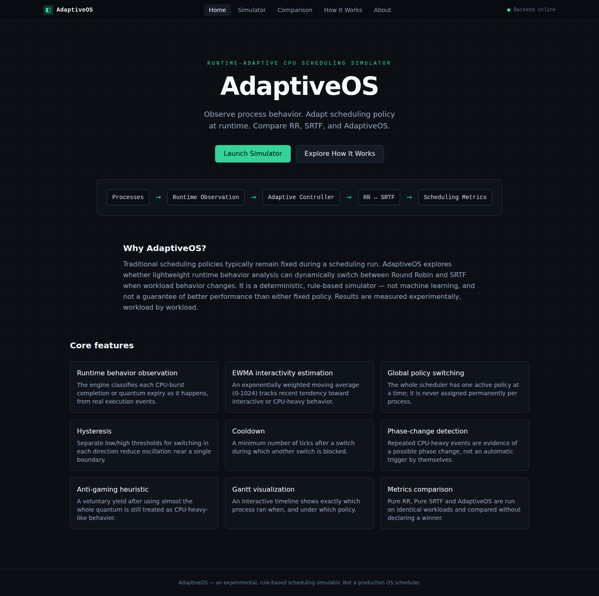
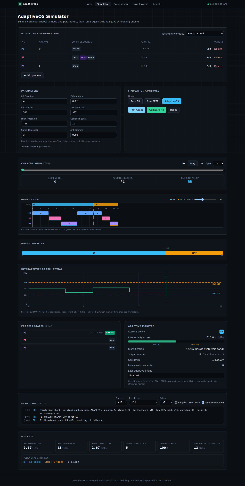
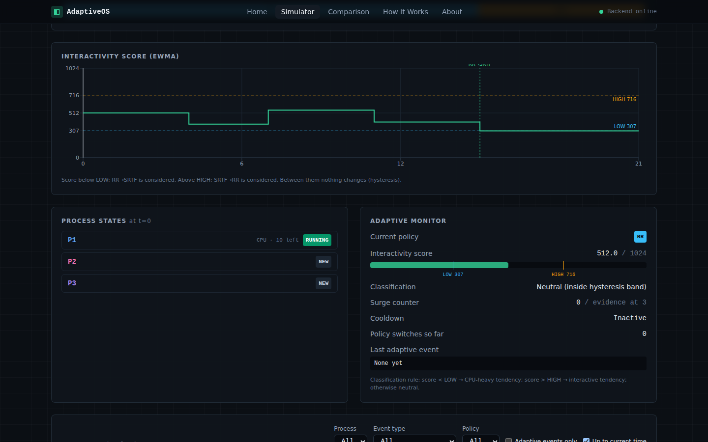
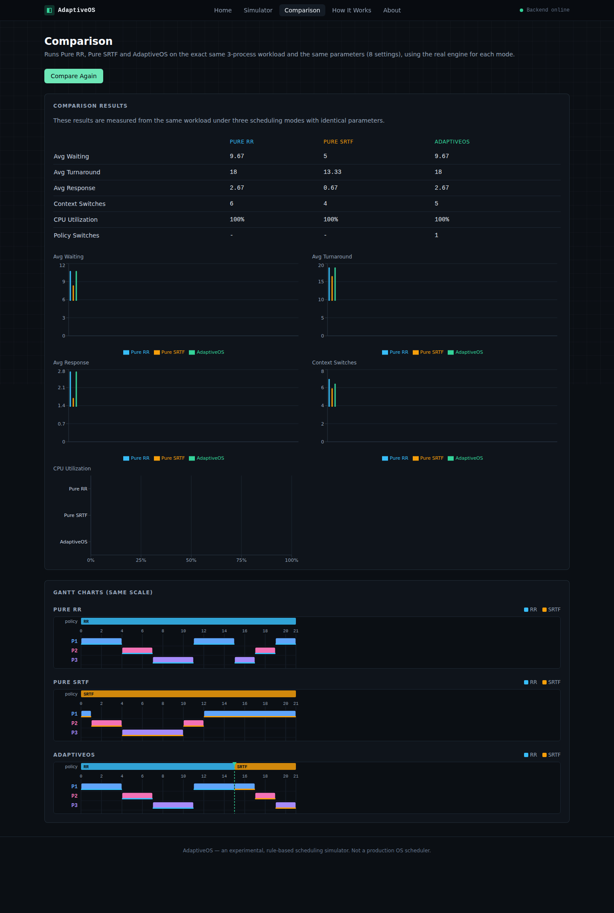
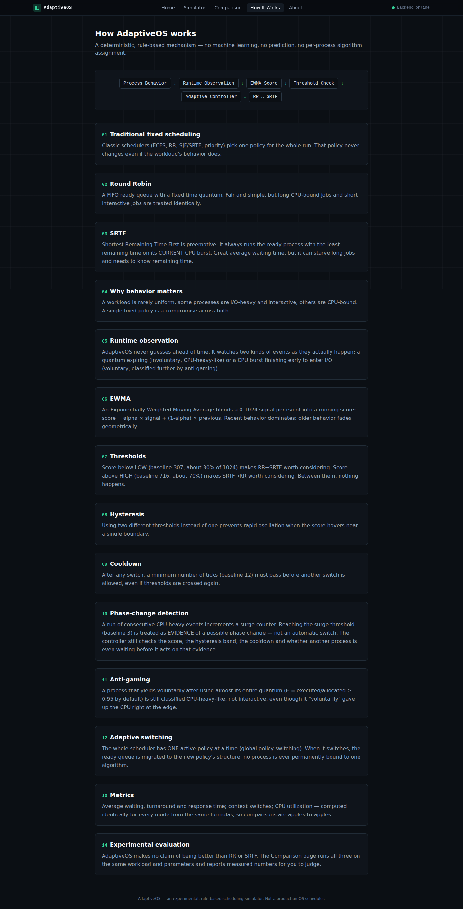

# AdaptiveOS

**Runtime-Adaptive CPU Scheduling Simulator** — a Java scheduling engine (Round Robin, SRTF, and a
deterministic rule-based adaptive controller that switches between them) exposed through a Spring Boot
REST API and visualized by a React/TypeScript frontend.

> AdaptiveOS is an experimental, rule-based scheduling simulator, not a modification of any real OS
> kernel, and it uses no machine learning. It does not claim to outperform Pure RR or Pure SRTF — the
> Comparison page measures that for whatever workload and parameters you give it.



## Contents

1. [Requirements](#1-requirements)
2. [Project structure](#2-project-structure)
3. [Backend setup](#3-backend-setup)
4. [Frontend setup](#4-frontend-setup)
5. [Running the backend](#5-running-the-backend)
6. [Running the frontend](#6-running-the-frontend)
7. [Running with Docker](#7-running-with-docker)
8. [Running tests](#8-running-tests)
9. [Using the simulator](#9-using-the-simulator)
10. [Creating custom workloads](#10-creating-custom-workloads)
11. [Changing AdaptiveOS parameters](#11-changing-adaptiveos-parameters)
12. [Understanding the results](#12-understanding-the-results)
13. [API endpoints](#13-api-endpoints)
14. [Architecture](#14-architecture)
15. [Screenshots](#15-screenshots)
16. [Troubleshooting](#16-troubleshooting)

---

## 1. Requirements

| Tool | Version | Needed for |
|---|---|---|
| JDK | 17+ | backend |
| Maven | 3.8+ (or use your IDE's bundled Maven) | backend |
| Node.js | 20+ | frontend |
| npm | 10+ (bundled with Node) | frontend |
| Docker + Docker Compose | optional | one-command run |

No database and no internet access are required at runtime.

## 2. Project structure

```
AdaptiveOS/
├── backend/                  Spring Boot API + the AdaptiveOS Java engine
│   ├── pom.xml
│   └── src/
│       ├── main/java/com/adaptiveos/
│       │   ├── AdaptiveOsApplication.java
│       │   ├── engine/        the original scheduling engine (model, scheduler, simulation, metrics,
│       │   │                  workload, logging) — framework-free, unmodified logic
│       │   ├── service/       SimulationService: the only bridge between REST and the engine
│       │   ├── dto/           request/response records
│       │   ├── controller/    REST controllers + the global error handler
│       │   └── config/        CORS and bean configuration
│       ├── main/resources/application.yml
│       └── test/java/com/adaptiveos/   engine tests + service tests + API integration tests
├── frontend/                  React + TypeScript + Vite + Tailwind + Recharts
│   └── src/
│       ├── components/        Gantt chart, policy timeline, score chart, adaptive monitor, event log, ...
│       ├── pages/              Home, Simulator, Comparison, How It Works, About
│       ├── services/api.ts    the only file that calls fetch()
│       ├── state/              workspace context (workload, parameters, last result)
│       ├── lib/                 validation, formatting, timeline helpers
│       └── types/simulation.ts TypeScript mirror of the backend DTOs
├── docs/                       ARCHITECTURE.md, API.md, TESTING_CHECKLIST.md
├── screenshots/                 real screenshots of the running app (see §15)
├── docker-compose.yml
└── README.md                    this file
```

## 3. Backend setup

```bash
cd backend
mvn -q -DskipTests package   # downloads dependencies and compiles; skips tests for a quick first build
```

## 4. Frontend setup

```bash
cd frontend
npm install
cp .env.example .env         # sets VITE_API_BASE_URL=http://localhost:8080/api; edit if needed
```

## 5. Running the backend

```bash
cd backend
mvn spring-boot:run
```
The API listens on **http://localhost:8080**. Check it with:
```bash
curl http://localhost:8080/api/health   # {"status":"UP"}
```
CORS is configured for `http://localhost:5173` and `:4173` by default (see
`application.yml` / `ADAPTIVEOS_CORS_ALLOWED_ORIGINS`).

### Running from an IDE (IntelliJ IDEA)
Open the `backend` folder as a Maven project, let it import, then run the `AdaptiveOsApplication`
class's `main` method (or right-click it → Run). Tests run the same way via the `src/test` folder or
`mvn test`.

## 6. Running the frontend

```bash
cd frontend
npm run dev
```
Open **http://localhost:5173**. The navbar shows "Backend online" once it can reach the API.

For a production build:
```bash
npm run build     # type-checks then builds to dist/
npm run preview   # serves dist/ on http://localhost:4173
```

## 7. Running with Docker

```bash
docker compose up --build
```
This builds and starts the backend (`:8080`) and a static, Nginx-served frontend build (`:8081`, calling
`http://localhost:8080/api`). Open **http://localhost:8081**. Stop with `docker compose down`.

The project also works fully without Docker (steps 5–6).

## 8. Running tests

```bash
# Backend: 63 engine tests + 81 service tests + Spring MockMvc integration tests
cd backend && mvn test

# Frontend: 45 tests (Vitest + Testing Library) covering validation, timeline helpers, the API client,
# and interactive components (burst editor, process table, event log filtering)
cd frontend && npm test
```

## 9. Using the simulator

1. Open the **Simulator** page.
2. Pick an example workload (Basic Mixed, CPU Heavy, Interactive, Phase Change, or an edge case) or
   build your own with **+ Add process**.
3. Choose a mode: **Pure RR**, **Pure SRTF**, or **AdaptiveOS**.
4. Adjust parameters if you want (hover/focus any field for an explanation); baseline values are
   pre-filled.
5. Click **Run Simulation**. The Gantt chart, policy timeline, score chart (AdaptiveOS only), process
   states, adaptive monitor, event log and metrics all populate from the real engine response.
6. Use Play/Pause, the scrubber, or click the Gantt chart to move the time cursor; process states and the
   adaptive monitor follow it.
7. Click **Compare All** (here or on the **Comparison** page) to run all three modes on the same
   workload and parameters side by side.

## 10. Creating custom workloads

In the process table, click **+ Add process**:
- **Process ID**: `P1`, `P2`, ... (must be unique).
- **Arrival time**: a non-negative whole number of ticks.
- **Burst sequence**: alternating CPU/I/O bursts. Rules (enforced in the UI and by the backend):
  the first and last burst must be CPU, and two I/O bursts cannot be adjacent (merge them into one).

Use the ↑/↓ buttons to reorder bursts, ✕ to delete one, and "+ CPU burst" / "+ I/O burst" to add more.

## 11. Changing AdaptiveOS parameters

All eight parameters are configurable in the **Parameters** panel (baseline values in parentheses):

| Parameter | Baseline | Meaning |
|---|---|---|
| RR Quantum | 4 | Length of a Round Robin time slice, in ticks |
| EWMA Alpha | 0.25 | How strongly a new event's signal outweighs history in the score update |
| Initial Score | 512 | Starting interactivity score (0–1024 scale) |
| Low Threshold | 307 | Below this, RR→SRTF is *considered* |
| High Threshold | 716 | Above this, SRTF→RR is *considered* |
| Cooldown | 12 | Ticks after a switch during which another switch is blocked |
| Surge Threshold | 3 | Consecutive CPU-heavy events counted as phase-change evidence |
| Anti-Gaming | 0.95 | Quantum-usage ratio at/above which a voluntary yield still counts as CPU-heavy |

These are **baseline experimental values**, not proven-optimal settings — that is exactly what the
Comparison page lets you investigate for your own workloads.

## 12. Understanding the results

- **Average Waiting / Turnaround / Response Time**, **Context Switches**, **CPU Utilization**: computed
  identically for every mode (`MetricsCalculator` in the engine), so comparisons are apples-to-apples.
- **Gantt chart**: one lane per process plus an idle lane; a colored band on top shows the active policy;
  dashed green markers show policy switches (AdaptiveOS only).
- **Interactivity score (EWMA)**: the controller's running score, with the LOW/HIGH thresholds drawn in.
- **Adaptive monitor**: the controller's live state — score, classification, surge counter, cooldown,
  switch count — all read directly from the engine's per-tick snapshot.
- **Event log**: every engine event (arrivals, dispatch, quantum expiry, I/O, EWMA updates, policy
  switches, ...), filterable by process, type, policy, and "adaptive events only".
- **Comparison page**: Pure RR vs Pure SRTF vs AdaptiveOS on the identical workload and parameters, with
  no policy ever labeled "best" or "winner" — you interpret the numbers.

## 13. API endpoints

See [`docs/API.md`](docs/API.md) for full request/response shapes. Summary:

| Method | Path | Purpose |
|---|---|---|
| POST | `/api/simulate` | Run one simulation (`PURE_RR` \| `PURE_SRTF` \| `ADAPTIVE`) |
| POST | `/api/compare` | Run all three modes on the same workload/parameters |
| GET | `/api/workloads` | List predefined example workloads |
| GET | `/api/workloads/{id}` | Get one predefined workload |
| GET | `/api/health` | Liveness check |

## 14. Architecture

See [`docs/ARCHITECTURE.md`](docs/ARCHITECTURE.md) for the full write-up, including exactly what was
(and was not) changed in the original engine. Summary:

```
React Frontend
      │
      ▼
Spring Boot REST API
      │
      ▼
AdaptiveOS Java Engine
      │
 ┌────┼────┐
 ▼    ▼    ▼
 RR  SRTF Adaptive
```

The engine (`com.adaptiveos.engine.*`) is the same deterministic, rule-based scheduler as the standalone
project: Round Robin, SRTF, and an `AdaptiveController` implementing EWMA scoring, hysteresis, cooldown,
phase-change evidence and an anti-gaming heuristic. `SimulationService` is the only code that calls into
it; the scheduling algorithm exists in exactly one place.

## 15. Screenshots

| | |
|---|---|
|  Home |  Simulator (AdaptiveOS run) |
|  Adaptive monitor & event log |  Comparison page |
|  How It Works | |

These are real screenshots of the running application (captured with a headless browser against a live
backend), not mockups.

## 16. Troubleshooting

**Navbar shows "Backend unreachable" / a red banner appears.**
The Spring Boot server isn't running or isn't reachable at the configured URL. Start it (`mvn
spring-boot:run` in `backend/`) and confirm `curl http://localhost:8080/api/health` works. If you changed
the backend port, update `VITE_API_BASE_URL` in `frontend/.env` and restart `npm run dev`.

**CORS error in the browser console.**
Add your frontend's origin to `ADAPTIVEOS_CORS_ALLOWED_ORIGINS` (comma-separated) as an environment
variable, or edit the default in `backend/src/main/resources/application.yml`, then restart the backend.

**"At least one process is required" / other validation errors.**
The workload or a parameter failed validation — the same rules run in the browser and on the server, so
this should show inline in the UI before you submit. Check the message; it names the specific field.

**Port already in use.**
Backend: `mvn spring-boot:run -Dspring-boot.run.arguments=--server.port=8090` (and update
`VITE_API_BASE_URL`). Frontend: `npm run dev -- --port 5174`.

**`mvn` can't download dependencies.**
Maven needs access to Maven Central (or your organization's mirror) the first time it builds. Corporate
proxies sometimes block this — configure a mirror in `~/.m2/settings.xml` if needed.

**Docker build is slow the first time.**
Both images download their toolchains and dependencies on first build; subsequent builds are cached.

**A simulation with a large workload feels slow or times out.**
The simulator caps requests at 50 processes, 101 bursts per process, and 100,000 worst-case ticks to
keep the local server responsive; reduce the workload size if you hit these limits.
